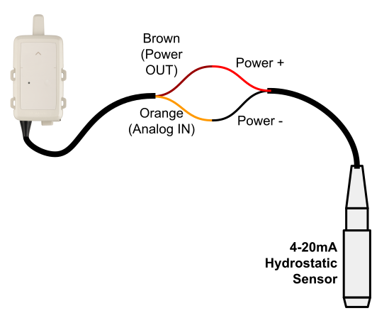

# Sensor 4-20ma v1.4.0

A reference app demonstrating how to interface to a 4-20mA analog sensor from the FlexSense and send the measurement over the Myriota satellite network.

## Operation

The FlexSense will measure and report the current (in uA) measured on the
analog input channel. It will also power the sensor during the time of the
measurement. An analog sensor reading will be performed before every satellite
message is sent.  The rate of the messages (and sensor readings) can be
configured by adjusting the number of messages a day. The application uses the
onboard GNSS receiver to report the last known location of the device. A GNSS
fix will be performed once a week. The device also reports the internal
temperature of the FlexSense.

> [!IMPORTANT]
> The application will default to powering the sensor at 24V. This
> may exceed the rating of some sensors and cause damage.  The FlexSense can be
> configured to also support 5V & 12V outputs. Please adjust the output to suit
> the selected sensor.

## Message Payload Format

| Byte Offset | Content | Type | Description |
| ----------- | ------- | ---- | ----------- |
| 0 | Sequence Number | uint8 | The sequence number of the message, i.e. message count. |
| 1 - 4 | Time | uint32 | The time of the location reading in [UTC](https://en.wikipedia.org/wiki/Coordinated_Universal_Time) time. This is in [Unix time](https://en.wikipedia.org/wiki/Unix_time) format (also called Epoch time). |
| 5 - 8 | Latitude | int32 | The latitude of the device recorded on the last call to `FLEX_GNSSFix` scaled by `1e7`. For example a received latitude value of `-891234567` is actually `-89.1234567`. |
| 9 - 12 | Longitude | int32 | The longitude of the device recorded on the last call to `FLEX_GNSSFix` scaled by `1e7`. For example a received longitude value of `1386073300` is actually `138.6073300`. |
| 13 - 14 | Onboard Temperature | int16 | The temperature inside the Myriota Module in degrees Celsius scale by 100.  For example a received value of 3000 is actually 30.00 C. |
| 15 - 16 | Sensor Current | uint16 | The current of an externally attached sensor. The current sensor reading is in micro-amps (uA). |

> [!IMPORTANT]
> Message data types are packed using little endian byte ordering.

## Wiring Diagram

Below is a diagram illustrating how to interface a "2-wire" 4-20mA sensor to
the FlexSense.

  

